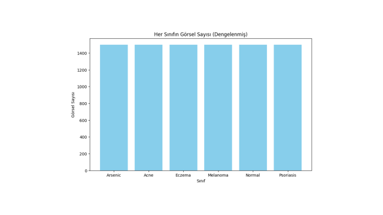

VERİ SETİ HAKKINDA :Derin öğrenme ile yapay zeka eğitimlerime devam ederken dermatoloji veri setleri üzerinde çalışmalar yaptım bu repoda kullandığım  hastalık veri seti 6 farklı hastalık sınıfı ile CNN kullanrak sınıflandırma yapıyor.

MODEL HAKKINDA :Bu veri setini eğitirken bazı sınıfların verileri 250ye kadar düşük seviyelerde olduğu için sınıfı az olan verilere data augmentation uygulayarak sınıfların veri sayısını yaklaşık 1500e kadar çıkardım

