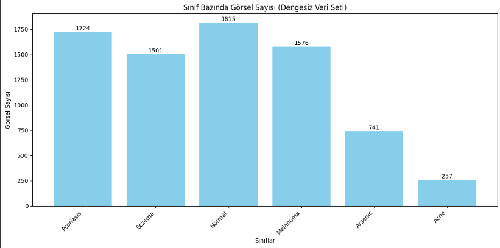
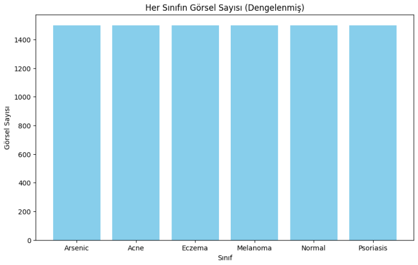
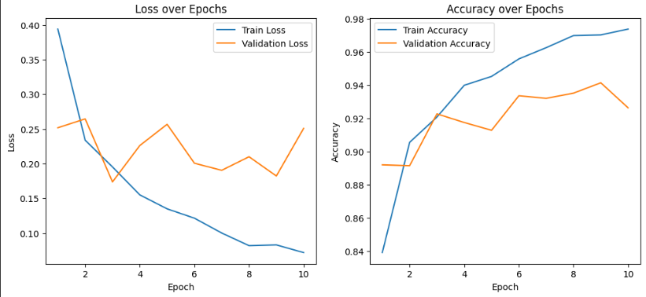
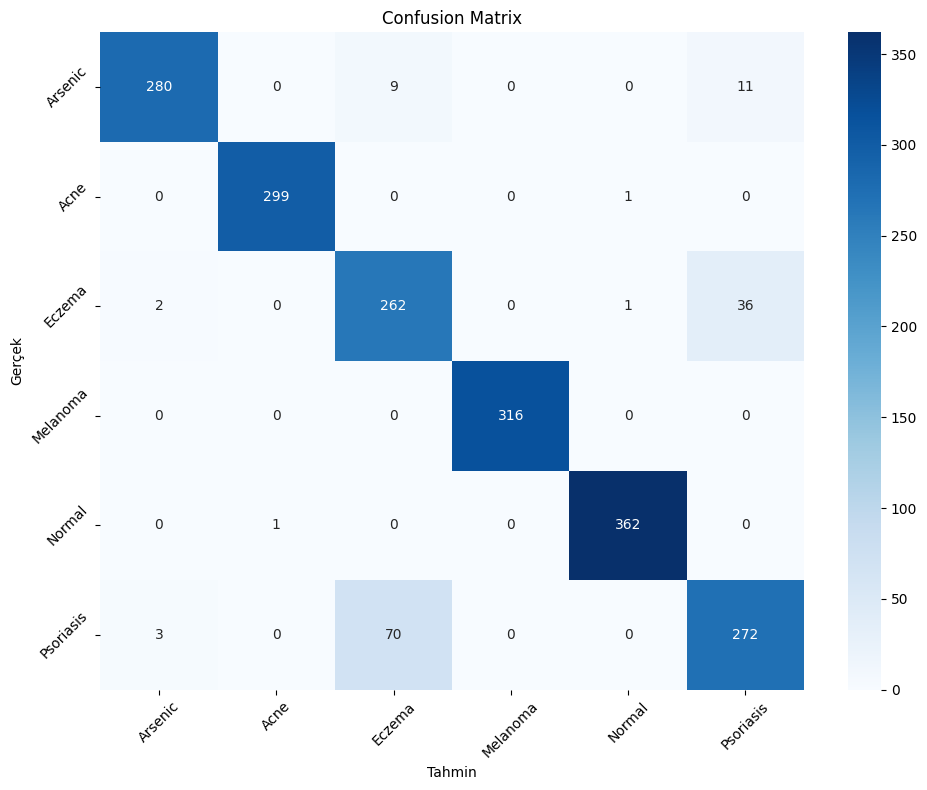

VERİ SETİ HAKKINDA :Derin öğrenme ile yapay zeka eğitimlerime devam ederken dermatoloji veri setleri üzerinde çalışmalar yaptım bu repoda kullandığım  hastalık veri seti 6 farklı hastalık sınıfı ile CNN kullanrak sınıflandırma yapıyor.

MODEL HAKKINDA :Bu veri setini eğitirken bazı sınıfların verileri 250ye kadar düşük seviyelerde olduğu için sınıfı az olan verilere data augmentation uygulayarak sınıfların veri sayısını yaklaşık 1500e kadar çıkardım

SINIF SAYISINI ARTTIRMA :Sınıf sayısını arttırdıktan sonra ise yeni sınıf dağılımı ;

Sınıf arttırımını gerçekleştirdikten sonra veriyi train ve validation (0.2 oranı ile) olarak ayırararak resnet 50 cnn modeli ile %94e kadar çıkan bir eğitim modeli geliştirdim  

sonuclari takip ettikten sonra confusion matrix ile sınıfların tahmin ve gerçek verileri bulma durmunu görebiliyoruz 

Sonraki aşamalarda ise modelin uygulamasını ve test kısımlarını ele aldım
